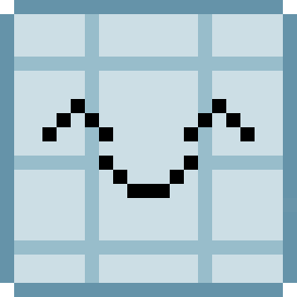
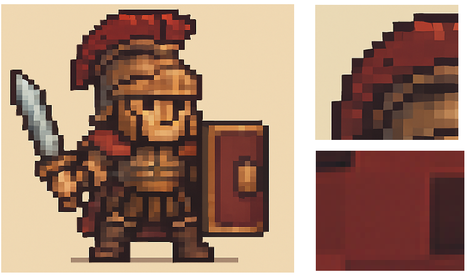
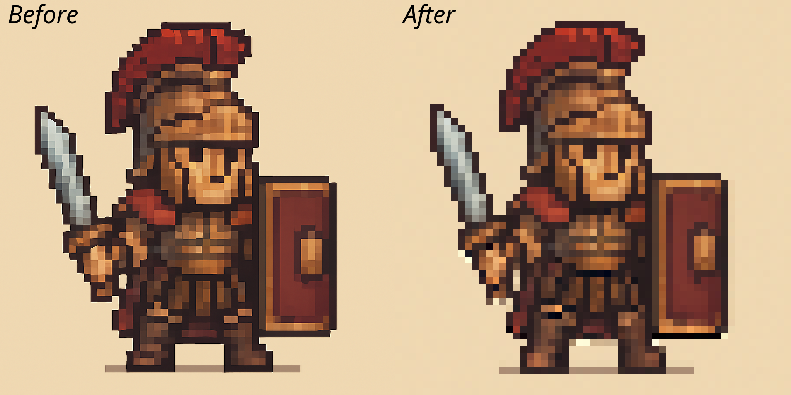

<div align="center">
  <a href="https://github.com/marksverdhei/spritegrid">
    
  </a>
</div>

# spritegrid  

Spritegrid is an image postprocessor for generative art. When general image generation models attempt to make pixel art, they often generate high-resolution images with janky pixels and grainy pixel colors. 



1. Pixels can be janky and pixels can be incorrectly aligned (half-pixels etc).
2. Pixels are grainy and don't contain a single color.
spritegrid divides 

Spritegrid converts these images into a grid and generates the pixel art in its appropriate resolution:





---
[](https://opensource.org/licenses/MIT)


## Installation

Prerequisites: `uv`
```bash
curl -LsSf https://astral.sh/uv/install.sh | sh
```  

```bash
git clone https://github.com/marksverdhei/spritegrid.git
```

```bash
uv sync
source .venv/bin/activate
```


## Usage

Run the tool from your terminal using the `cli.py` script.

```bash
usage: cli.py [-h] [--min-grid MIN_GRID] [-o FILENAME] [-i] [-d] image_source

Detect grid in AI pixel art & create downsampled image or debug overlay.

positional arguments:
  image_source          Path to the local image file or URL of the image.

options:
  -h, --help            show this help message and exit
  --min-grid MIN_GRID   Minimum expected grid dimension (width or height) for peak detection. (Default: 4)
  -o FILENAME, --output FILENAME
                        Save the output image (downsampled by default, or debug overlay if -d is used) to FILENAME.
  -i, --show            Display the output image (downsampled by default, or debug overlay if -d is used) using the default system viewer.
  -d, --debug           Enable debug mode: output/show a grid overlay instead of the downsampled image. Defaults to showing if -o or -i are not specified.
```

## Example  

```bash
python cli.py assets/dragon.png -o pixel-art.png
```